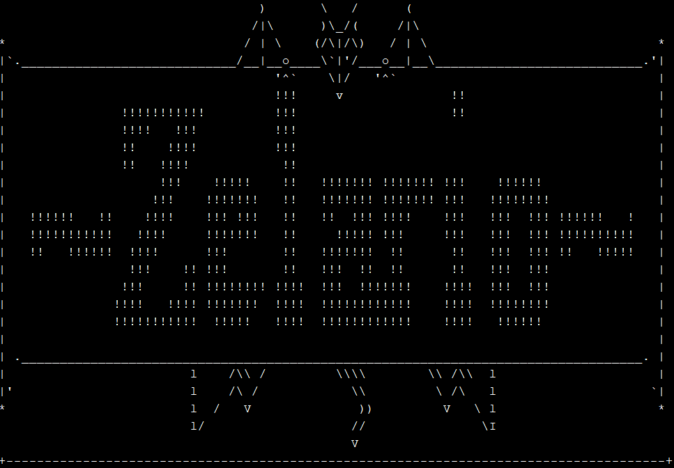
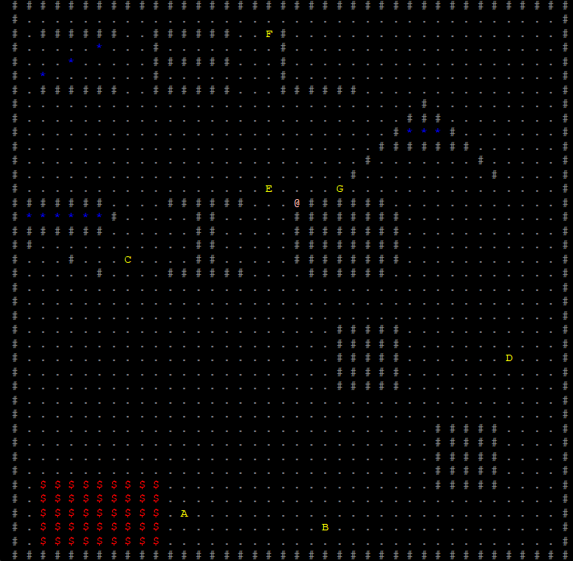
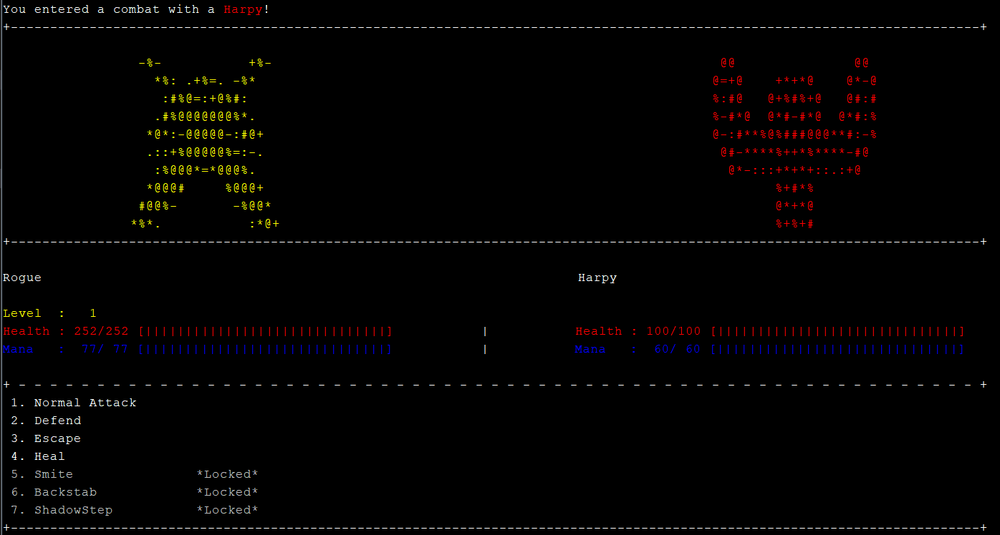
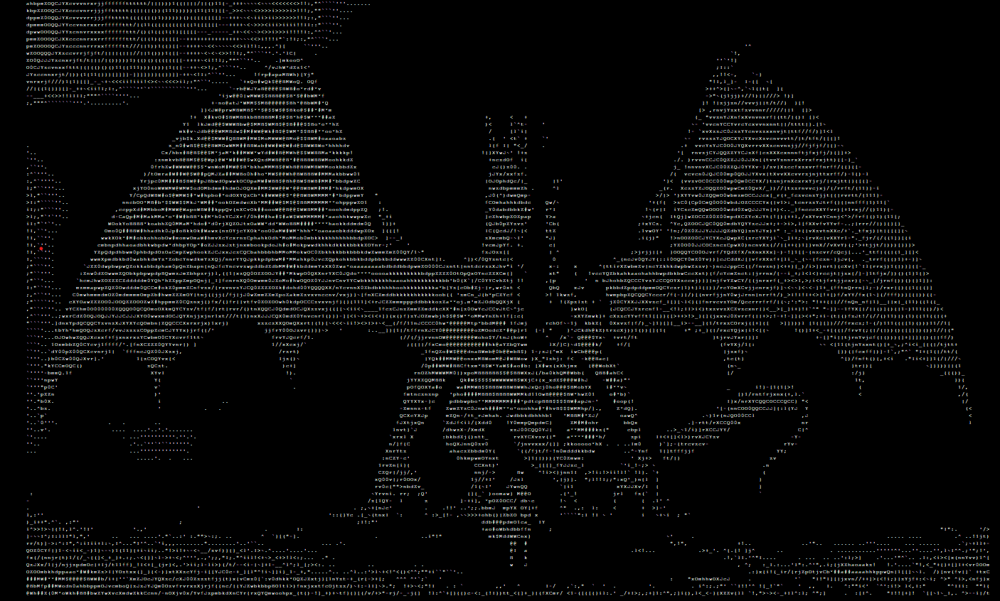

# Zelario

Zelario is a CLI (Command Line Interface) style turn based RPG game. 

## Features
#### Classes
The player is able to choose between 5 different classes that has different abilities and stats.

#### Leveling
As the player defeats monsters, stronger monsters will appear and the player is rewarded EXP to level up their hero.

#### Map

There is a map where player can navigate using WASD or arrow keys.

#### Combat

The player is able to cast spell, normal attack or run.

#### Status Effects
Some monsters or heroes is able to debuff or deal DoT to the opponent.

#### Saving and Loading
Players can save their own progress and load it with the corresponding account.

#### ASCII

ASCII art is shown in the game, adhering to the CLI theme.